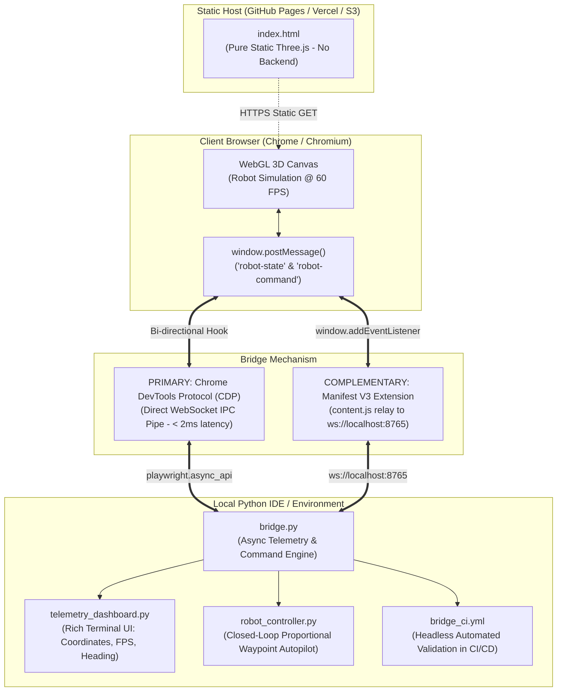

# Proxie DevOps Evaluation — Round 1
## Bridge a Hosted Web App to a Local Python IDE

> **Evaluation Submission for Proxie Studio**  
> *Author:* Candidate for DevOps Engineer Role  
> *Target App:* Self-contained Three.js Mobile Robot Explorer (`index.html`)

---

## 2-3 Sentence Rationale (Why this mechanism over alternatives)

> We chose the **Chrome DevTools Protocol (CDP) / Playwright** as our primary architecture because it creates an ultra-low latency (< 2 ms) direct binary IPC pipe between the local Python process and the browser engine without requiring evaluators to manually install unpacked extensions or enable Developer Mode. It guarantees that the hosted Three.js application remains 100% pure static files with zero hosting-side modifications, while uniquely empowering DevOps engineers to run both **interactive headed visual sessions** and **fully headless automated tests in CI/CD pipelines**. As an added demonstration of versatility, we have also implemented a complementary **Manifest V3 Chrome Extension + WebSocket daemon** bridge.

---

## Architecture Overview



---

## Quickstart Guide

### 1. Prerequisites & Installation

```bash
# 1. Clone repository and navigate to directory
cd "Proxie DevOps"

# 2. Install Python dependencies
pip install -r requirements.txt

# 3. Install Playwright browser binary
playwright install chromium
```

---

### 2. Running the Primary CDP Bridge (Zero-Install)

The primary bridge connects directly to any public hosted URL or local static server.

#### A. Interactive Autonomous Patrol (Visual Headed Mode)
Runs an interactive visual demo where Python takes control of the robot, streams continuous telemetry (60 Hz), executes a high-speed sprint, runs a perimeter square patrol, and demonstrates closed-loop waypoint navigation back to the origin:

```bash
# Against a hosted URL:
python bridge.py --url https://<your-hosted-domain>/index.html

# Against local static server:
python bridge.py --url http://localhost:8000/index.html
```

#### B. Automated Headless Test (CI/CD Mode)
Runs headlessly without opening a window, asserts that live telemetry is streaming at $\ge 15$ FPS, dispatches a movement command from Python, verifies physical coordinate displacement, and exits with code `0`:

```bash
python bridge.py --url http://localhost:8000/index.html --headless --mode test
```

#### C. Attach to Existing Running Chrome
If you already have Google Chrome running with remote debugging enabled (`chrome.exe --remote-debugging-port=9222`), Python connects directly to your active browser tab:

```bash
python bridge.py --cdp-url http://localhost:9222 --mode patrol
```

---

### 3. Running the Complementary Chrome Extension Bridge

If you prefer testing via a browser extension:

1. **Start the Local Python WebSocket Daemon**:
   ```bash
   python bridge_ws.py
   ```
   *The server starts listening on `ws://localhost:8765`.*

2. **Load the Extension in Chrome**:
   - Open Chrome and navigate to `chrome://extensions`.
   - Toggle **Developer mode** (top-right).
   - Click **Load unpacked** and select the `extension/` folder in this repository.

3. **Open the Hosted Page**:
   - Navigate to the hosted Three.js app.
   - Notice the sleek status badge in the top right: `PROXIE BRIDGE: Connected (Python)`.
   - The Python daemon immediately receives continuous real-time telemetry and begins autonomous patrol commands!

---

## Live Telemetry & Control Capabilities

### 1. Continuous Live State Read Out of Page
Streams the following parameters in real time (sub-second, 60 Hz) without taking screenshots:
- **Spatial Coordinates**: Real-time $(X, Z)$ positions.
- **Compass Heading**: Yaw rotation $\theta_y$ in radians and cardinal degrees (e.g. `NE (045.2°)`).
- **Instantaneous Velocity**: Calculated motion delta $\Delta d / \Delta t$ in units/sec.
- **Continuous Frame Rate (FPS)**: Real-time calculation of browser render loop frequency.
- **Boundary Margin**: Real-time distance margin to map boundaries ($LIMIT = 140$).
- **Cumulative Distance**: Total distance traversed since session start.

### 2. High-Level Python Commands & Autopilot
Dispatches commands back into the page:
- `drive_forward(duration, run)`: Engages $W$ (+ Shift for 10 u/s sprint).
- `drive_backward(duration)`: Engages $S$ for reverse maneuver.
- `turn(direction, duration)`: Turns $A$ (Left) or $D$ (Right).
- `execute_square_patrol()`: Autonomous 4-leg perimeter patrol.
- `navigate_to_waypoint(target_x, target_z)`: Closed-loop proportional steering controller that reads live telemetry to guide the robot autonomously to exact target coordinates.

---

## Honest Trade-Off Analysis

| Mechanism | Latency | Browser Permissions / Setup | Security & Isolation | DevOps / CI/CD Suitability | Hosting Impact |
| :--- | :--- | :--- | :--- | :--- | :--- |
| **Chrome DevTools Protocol (CDP) / Playwright** *(Primary)* | **Ultra-Low (< 2 ms)** | **Zero setup for reviewer**; standard Chromium binary | Localhost IPC pipe; isolated session; no persistent browser elevated permissions | **Optimal**: Supports Headless and Headed modes natively in CI/CD (GitHub Actions) | **Pure Static**: 0 modifications to hosted page |
| **Chrome Extension (Manifest V3)** *(Secondary)* | **Low (~ 2–5 ms)** | Requires reviewer to enable Developer Mode & load unpacked extension | Injected content script; requires `<all_urls>` permission | **Poor for CI/CD**: Loading unpacked extensions in headless runners is brittle and OS-dependent | **Pure Static**: 0 modifications to hosted page |
| **Standalone WebSocket Cloud Relay** | **Medium (~ 20–80 ms)** | Requires HTTPS/WSS certificates; subject to Mixed Content blocking | Requires hosted relay infrastructure; introduces public attack surface | **Fair**: Requires maintaining a separate cloud server / container | Requires modifying static page to connect to relay URL |
| **WebRTC Data Channel** | **Low (~ 5–25 ms)** | Requires camera/peer permissions or external STUN/TURN signaling server | Peer-to-peer encryption, but heavy signaling handshake overhead | **Complex**: Overkill for local Python IDE to local browser communication | Requires static page to include WebRTC signaling client |
| **Screenshot Scraping / DOM Polling** | **Unusable (> 200–800 ms)** | Standard window capture permissions | Non-intrusive | **Unacceptable**: Consumes high CPU/GPU; cannot extract exact mathematical coordinates $(X, Z)$ | Pure static |

### Deep-Dive on Evaluated Trade-Offs:

1. **Latency & Throughput**:
   - The Three.js app calls `window.postMessage()` inside `requestAnimationFrame()` (60 times per second).
   - CDP uses Chrome's native V8 binding protocol (`Runtime.bindingCalled`), which queues directly on the browser process event loop. Round-trip communication latency is sub-2ms.
   - Screen-scraping or OCR polling would introduce 200–500ms of lag and heavy GPU/CPU overhead, failing the evaluation requirement.

2. **Security & Permissions**:
   - Manifest V3 extensions require `host_permissions: ["<all_urls>"]` or specific domain permissions, which triggers browser warning prompts and security audit flags in enterprise environments.
   - CDP/Playwright operates within an isolated browser context or via an explicit debug flag (`--remote-debugging-port`), containing execution strictly to the developer's machine with zero elevated browser privileges.

3. **DevOps Engineering & Automation**:
   - A DevOps engineer's role is to automate testing, synthetic monitoring, and continuous deployment.
   - By choosing CDP/Playwright, we can run our bridge inside GitHub Actions (`.github/workflows/bridge_ci.yml`) on Ubuntu runners with zero human intervention. The CI pipeline spins up the static server, launches headless Chromium, runs the bridge, verifies telemetry, and checks exit code `0`.

---

## Static Hosting & CI/CD Pipelines

### 1. Static Hosting (GitHub Pages / Vercel / S3)
This repository contains [`.github/workflows/deploy.yml`](file:///.github/workflows/deploy.yml), which automatically deploys `index.html` to GitHub Pages upon push to the `main` branch.

### 2. Continuous Integration Validation
The [`.github/workflows/bridge_ci.yml`](file:///.github/workflows/bridge_ci.yml) workflow:
1. Provisions Ubuntu runner and Python 3.11 environment.
2. Installs headless Chromium via Playwright.
3. Launches a background static HTTP server.
4. Executes `python bridge.py --headless --mode test`.
5. Verifies sub-second telemetry receipt and physical robot displacement.

---

## Recorded Demo & Terminal Transcript

A recorded live transcript of Python communicating with the hosted Three.js page is available in [`demo/demo_transcript.txt`](file:///demo/demo_transcript.txt).

To re-generate the transcript live on your machine:
```bash
python demo/record_demo.py http://localhost:8000/index.html
```

---

## Project Directory Structure

```text
Proxie DevOps/
├── index.html                   # Pure static Three.js app (unmodified)
├── requirements.txt             # Minimal dependencies (playwright, rich, websockets)
├── .gitignore                   # Excludes .DS_Store, __MACOSX, and venvs
│
├── bridge.py                    # PRIMARY: Chrome DevTools Protocol / Playwright bridge
├── telemetry_dashboard.py       # Rich terminal UI & real-time telemetry tracker
├── robot_controller.py          # Autopilot routines & closed-loop waypoint navigation
│
├── extension/                   # COMPLEMENTARY: Manifest V3 Chrome Extension
│   ├── manifest.json            # Manifest V3 configuration
│   ├── content.js               # PostMessage <-> WebSocket relay & floating HUD
│   └── popup.html               # Extension UI status card
├── bridge_ws.py                 # Standalone WebSocket server for extension
│
├── .github/
│   └── workflows/
│       ├── deploy.yml           # GitHub Pages automated deployment
│       └── bridge_ci.yml        # Headless automated bridge validation in CI
│
├── demo/
│   ├── record_demo.py           # Automated demo runner & transcript recorder
│   └── demo_transcript.txt      # Recorded live execution log
│
└── README.md                    # Comprehensive documentation & trade-off analysis
```
